# Samples of art I have created with the help of books:

## 28/05/2022 
### rainbow spectrums playing with Hue and Saturation:
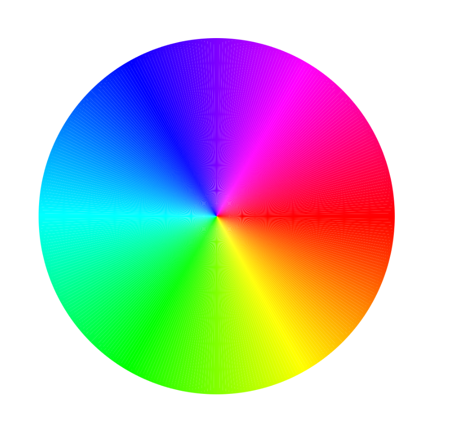

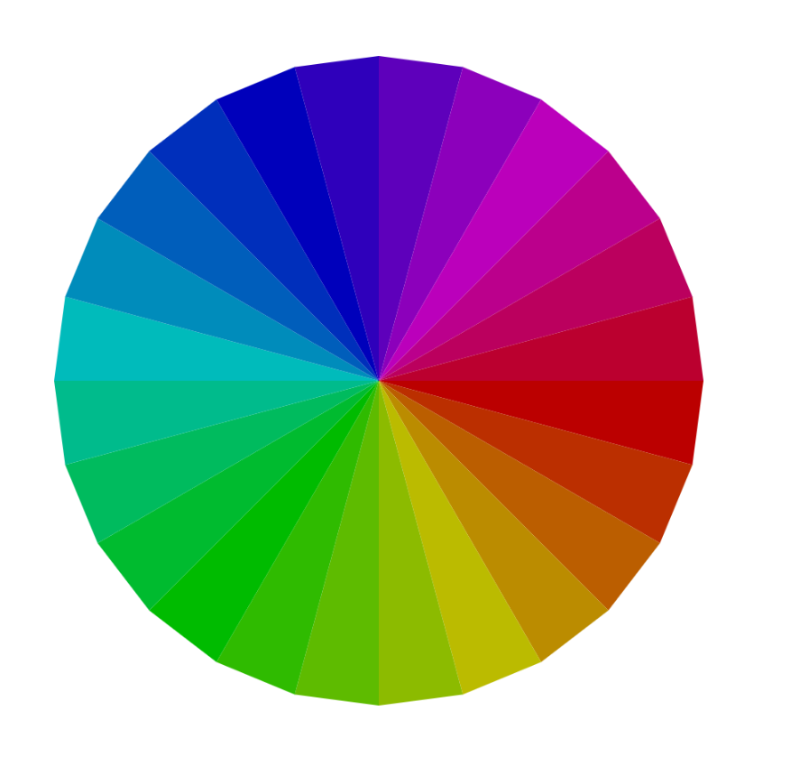

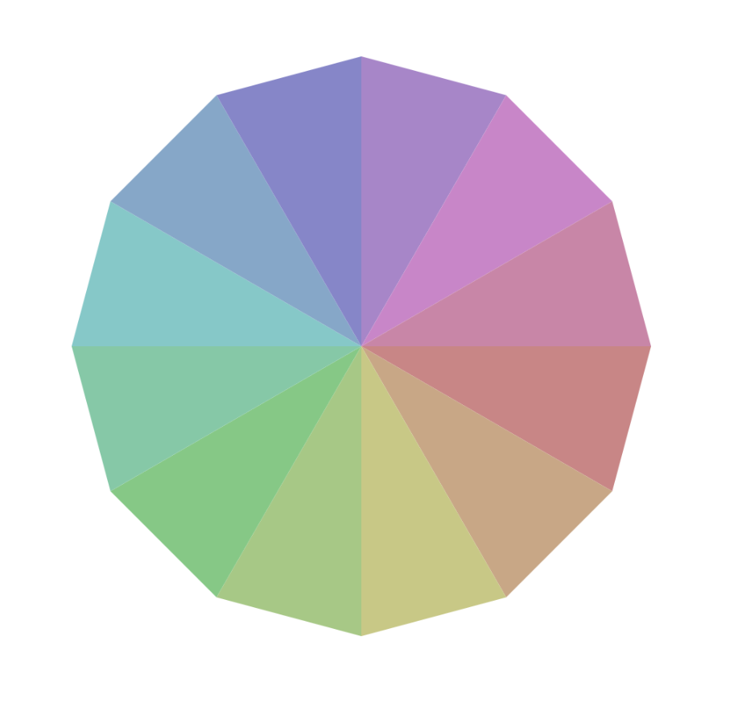

## 29/05/2022
### A grid of colours with interpolation:
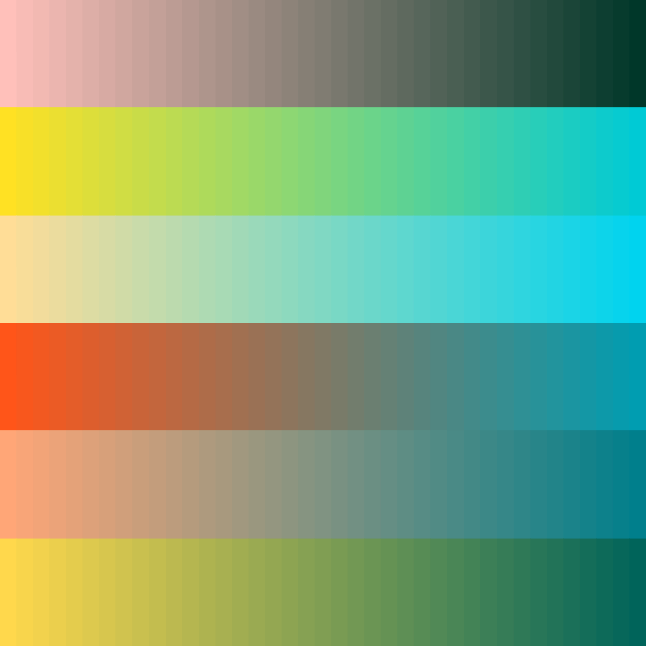

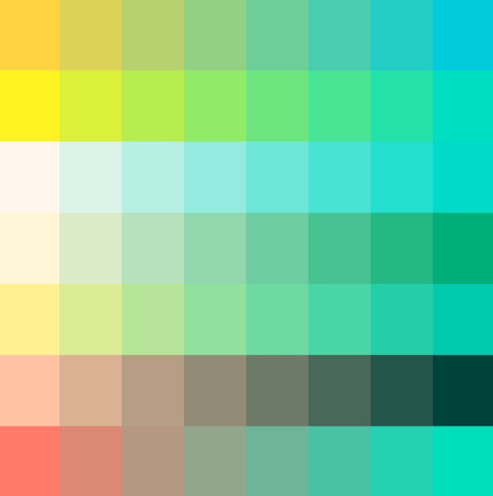

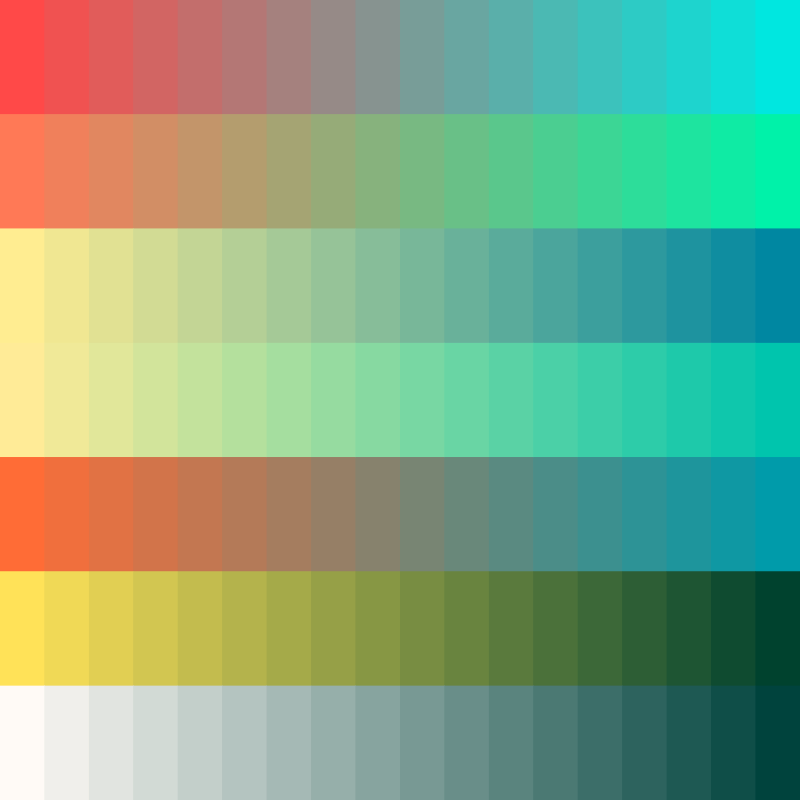

## 30/05/2022
### Color Palletes from Image - Featuring various Towns from Sweden + Norway:
#### Eskilstuna, Sweden
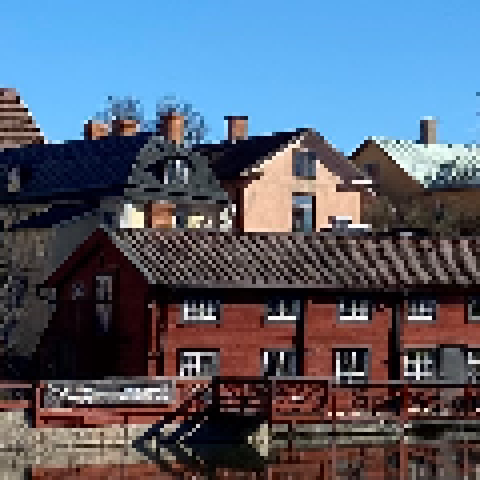
### Distorted the Image with Hue & Saturation
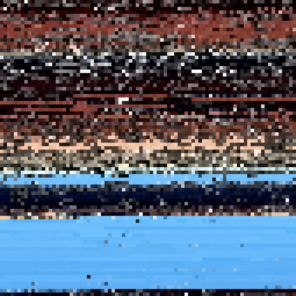
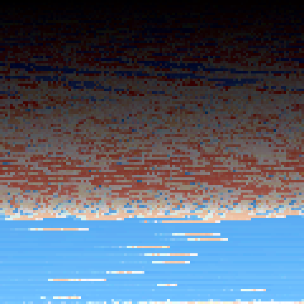

#### Narvik, Norway
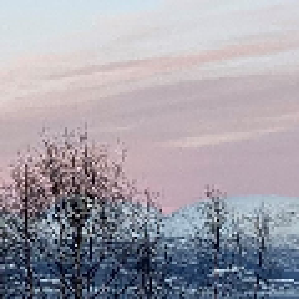
### Distorted the Image Saturation
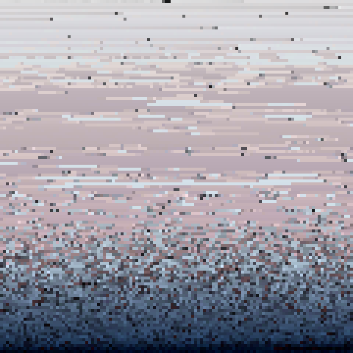

#### Västerås, Sweden
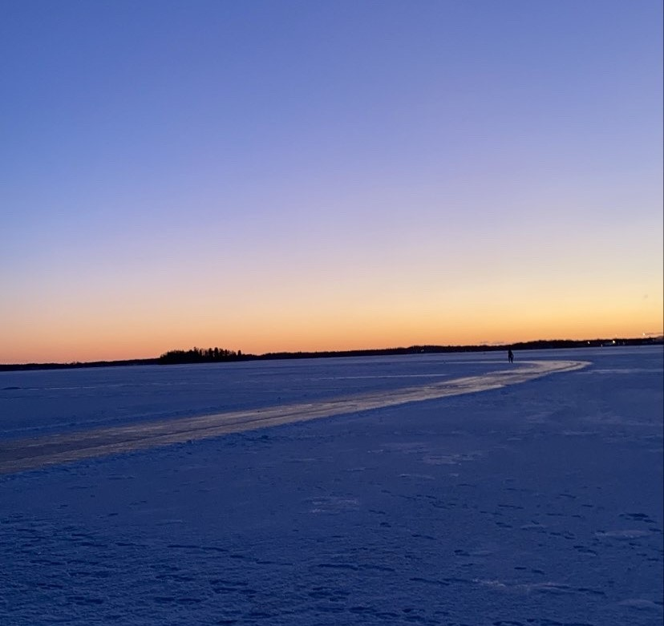
### Distorted the Image with Hue & Saturation
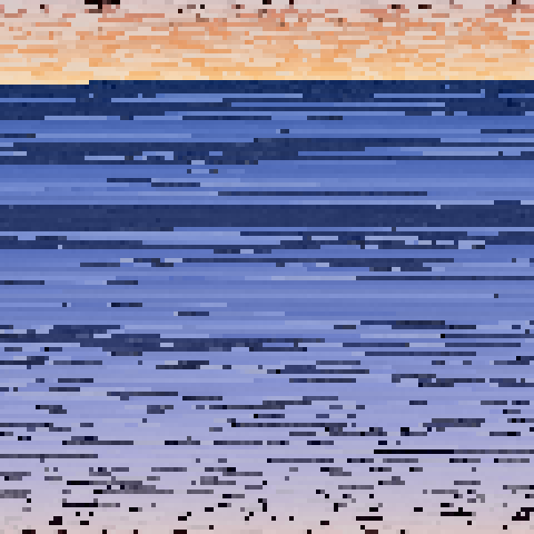
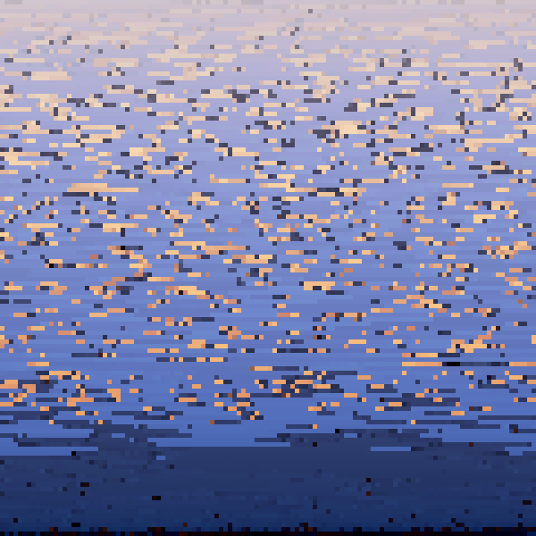

